# Análise de Formulário: Underblock Insider vs Boost Research
## Benchmark competitivo + Proposta de teste A/B

**Data:** 04/mai/2026
**Objetivo:** Mapear o formulário de aplicação da Mentoria Underblock Insider e extrair aprendizados para o funil Boost Research.

---

## 1. Contexto

A Mentoria Underblock Insider é o produto high-ticket de Vinícius Bazan (R$26.990, 50 vagas). O funil usa um formulário de aplicação com 18 perguntas na plataforma Respondi.app (typeform-like) como mecanismo de qualificação e venda.

A Boost Research usa um formulário curto (5 campos) na LP analise.boostresearch.com.br para captura de leads via análise gratuita de carteira. O produto final é o **Crypto Intelligence PRO** (ticket ~R$20k/ano).

Os dois modelos atendem o mesmo ICP: investidor com patrimônio acima de R$100k interessado em cripto.

---

## 2. Mapeamento completo do form Underblock

**Plataforma:** Respondi.app (1 pergunta por tela, estilo Typeform)
**URL:** `form.respondi.app/yoVjQtzf`
**Thank you page:** `lp2.underblock.com.br/mnt01/typ-y.html`

---

### Tela de abertura (Intro)

**Título:** "MENTORIA UNDERBLOCK INSIDER — FORMULÁRIO DE APLICAÇÃO"
**Texto:** Aviso de que o preenchimento não garante vaga. Apenas 50 vagas. Contato via WhatsApp ou e-mail.
**Botão:** "Começar"

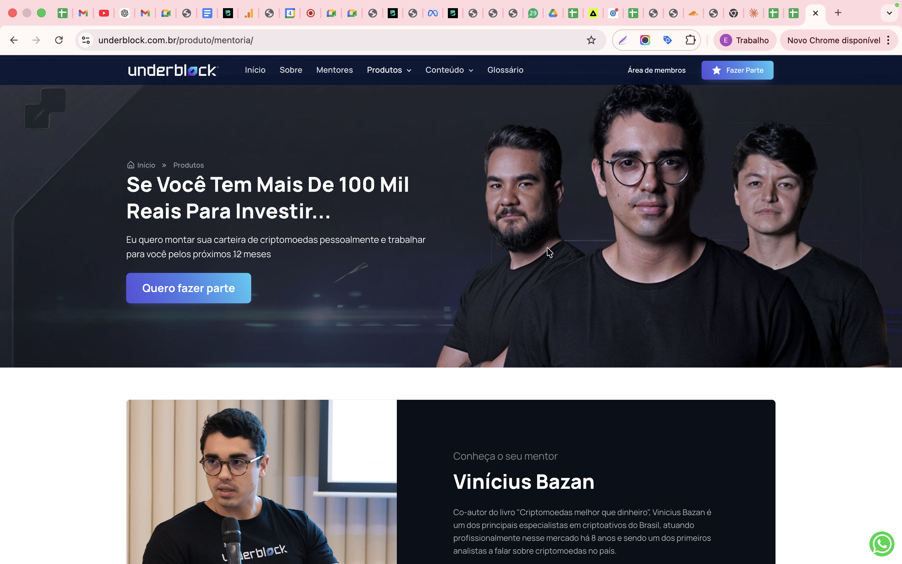

---

### Pergunta 1 — Nome completo

- **Tipo:** Texto livre
- **Pergunta:** "Seu nome completo"

---

### Pergunta 2 — E-mail

- **Tipo:** Campo e-mail
- **Pergunta:** "Seu melhor e-mail para contato"

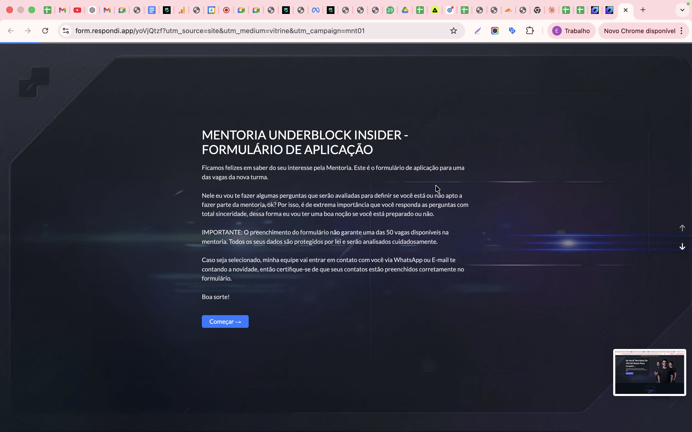

---

### Pergunta 3 — WhatsApp

- **Tipo:** Telefone com máscara BR + bandeira
- **Pergunta:** "Seu celular (WhatsApp)"
- **Obs:** Validação ativa — mostra "Informe um telefone válido" se inválido
- **Nota:** Texto auxiliar: "se for de fora do Brasil, insira o código do país"

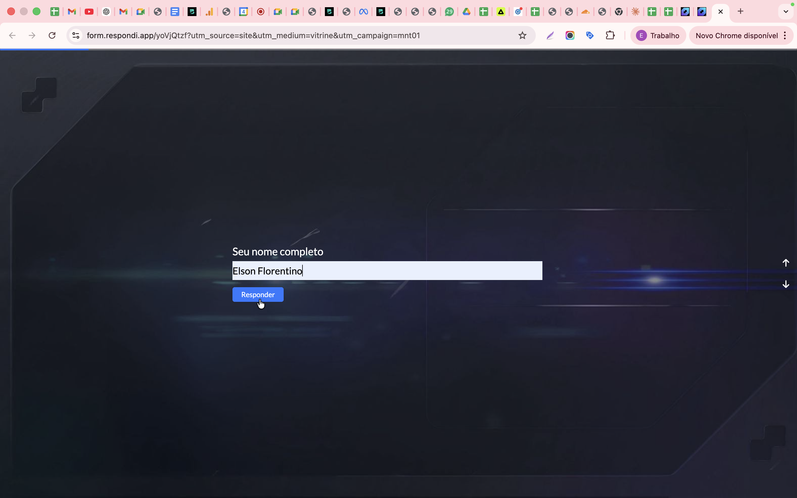

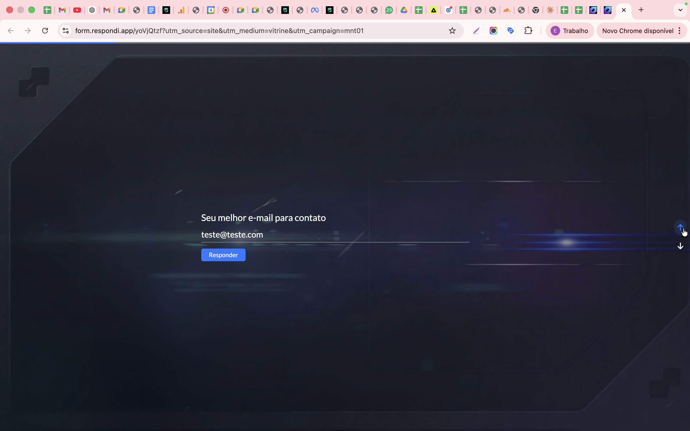

---

### Pergunta 4 — Motivação (texto longo)

- **Tipo:** Textarea
- **Pergunta:** "Por que você acredita que deve preencher uma das vagas na Mentoria UB Insider?"
- **Dica:** "Aperte Shift + Enter para quebrar a linha"

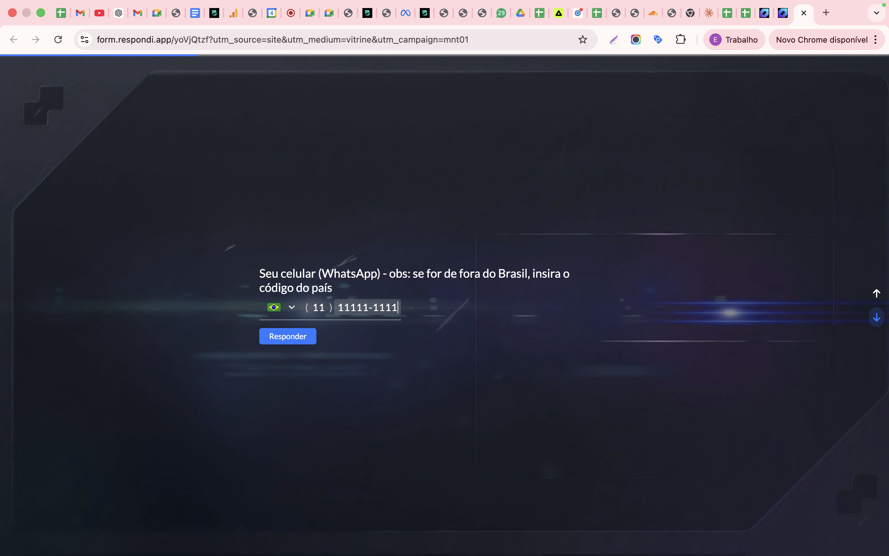

---

### Pergunta 5 — Tempo de acompanhamento

- **Tipo:** Múltipla escolha (1 resposta)
- **Pergunta:** "Há quanto tempo você acompanha o meu trabalho?"
- **Opções:**
  - A) Menos de 1 ano
  - B) 1 a 2 anos
  - C) 2 a 3 anos
  - D) 3 a 4 anos
  - E) Mais de 4 anos

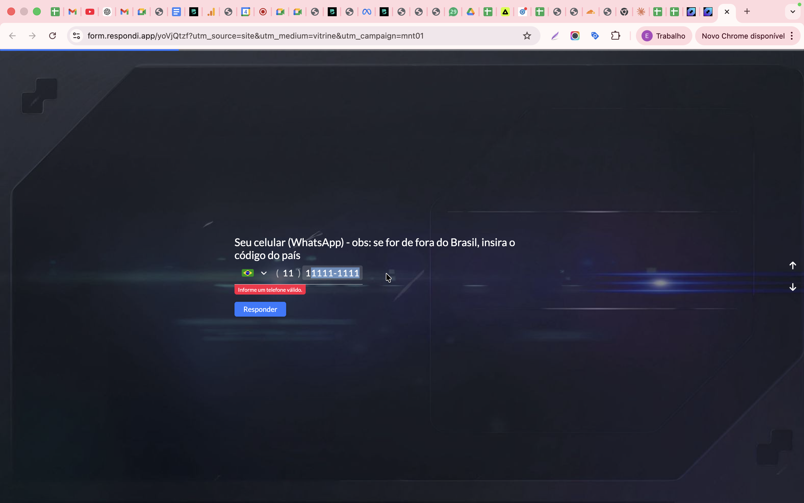

---

### Pergunta 6 — Renda mensal

- **Tipo:** Múltipla escolha
- **Pergunta:** "Qual é a sua renda mensal atual?"
- **Opções:**
  - A) Menos de 5 mil
  - B) De 5 a 10 mil
  - C) De 10 a 20 mil
  - D) De 20 a 50 mil
  - E) Mais de 50 mil

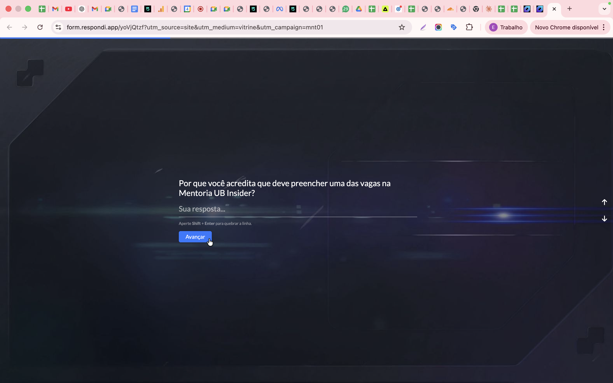

---

### Pergunta 7 — Já investe em cripto?

- **Tipo:** Sim/Não
- **Pergunta:** "Você já investe em criptomoedas?"
- **Opções:** A) Sim, B) Não

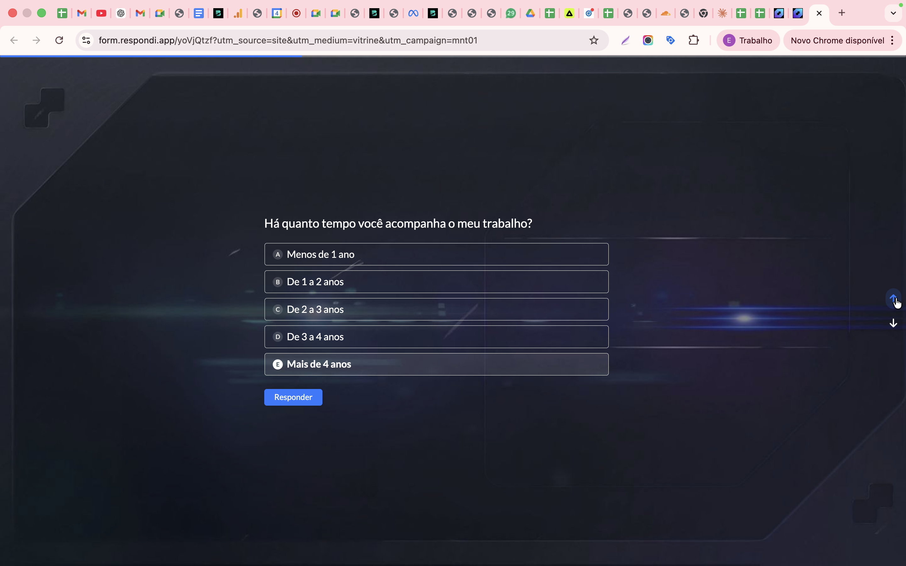

---

### Pergunta 8 — Outros mercados (multi-select)

- **Tipo:** Múltipla seleção (várias respostas)
- **Pergunta:** "Você já investe em outros mercados? Se sim, em quais? Selecione quantas opções quiser"
- **Opções:**
  - A) Poupança
  - B) Renda Fixa
  - C) Ações
  - D) Fundos de Investimento
  - E) Ainda não invisto
  - F) Outro

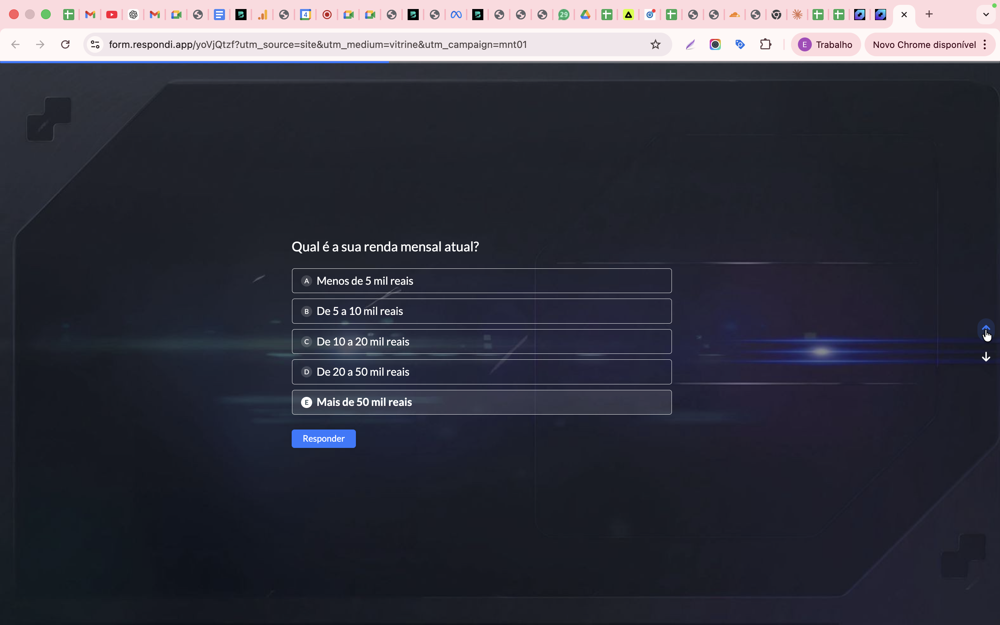

---

### Pergunta 9 — Patrimônio total investido

- **Tipo:** Múltipla escolha
- **Pergunta:** "No geral, quanto você tem investido hoje? (total, todos os ativos)"
- **Opções:**
  - A) Menos de 10 mil reais
  - B) De 10 a 50 mil reais
  - C) De 50 a 100 mil reais
  - D) De 100 a 200 mil reais
  - E) De 200 a 500 mil reais
  - F) De 500 mil a 1 milhão de reais
  - G) Mais de 1 milhão de reais
  - H) Ainda não invisto

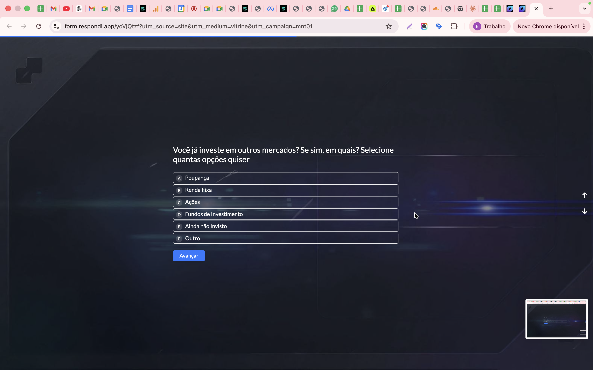

---

### Pergunta 10 — Patrimônio cripto projetado (12 meses)

- **Tipo:** Múltipla escolha
- **Pergunta:** "Somando o que você já tem investido em cripto e o que pretende investir nos próximos 12 meses, selecione um valor correspondente abaixo:"
- **Opções:** Mesmas 8 faixas da pergunta 9

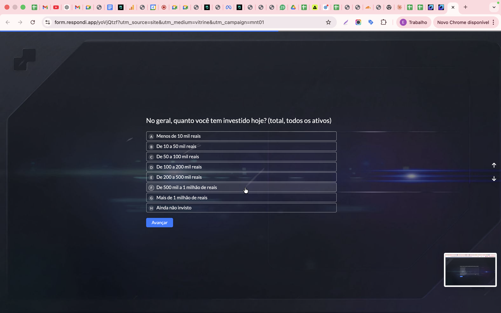

---

### Pergunta 11 — Nível de conhecimento

- **Tipo:** Múltipla escolha
- **Pergunta:** "Defina o seu nível de conhecimento em criptomoedas"
- **Opções:**
  - A) Iniciante
  - B) Intermediário
  - C) Avançado

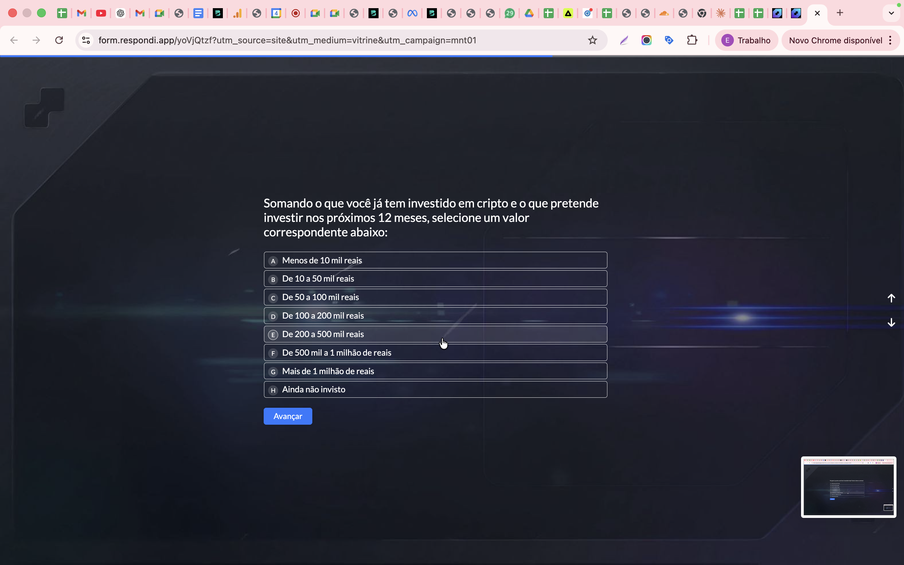

---

### Pergunta 12 — Concorrente / casa de análise atual

- **Tipo:** Texto livre
- **Pergunta:** "Você assina algum serviço de recomendação ou casa de análise voltada para cripto? Se sim, qual?"
- **Detalhe:** Botão muda de "Avançar" para "Responder" quando preenchido

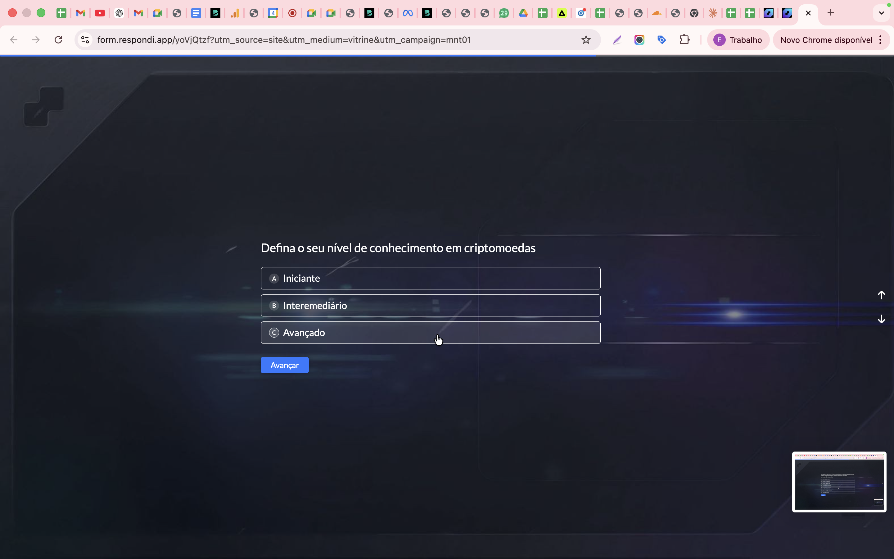

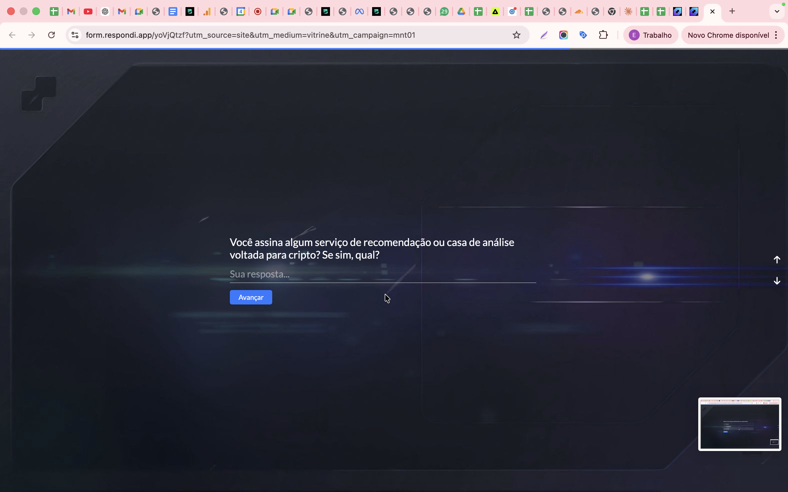

---

### Pergunta 13 — Expectativa

- **Tipo:** Texto livre
- **Pergunta:** "Caso consiga uma vaga na Mentoria Underblock Insider, como você acha que eu posso te ajudar?"

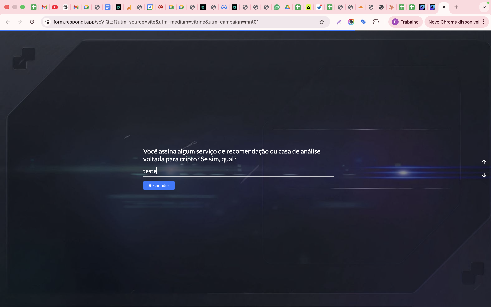

---

### Pergunta 14 — Prova social (OBRIGATÓRIA)

- **Tipo:** Textarea (campo obrigatório, com validação)
- **Pergunta:** "Você já ganhou dinheiro seguindo alguma recomendação minha? Descreva sua experiência em detalhes. Ex: 'Investi na moeda X recomendada pelo Bazan e ganhei X em X tempo.'"
- **Aviso em destaque:** "*IMPORTANTE: Estou em busca dos meus melhores alunos/seguidores e o seu comentário pode te ajudar a ser selecionado."
- **Validação:** Badge vermelha "Essa resposta é obrigatória" se tentar pular

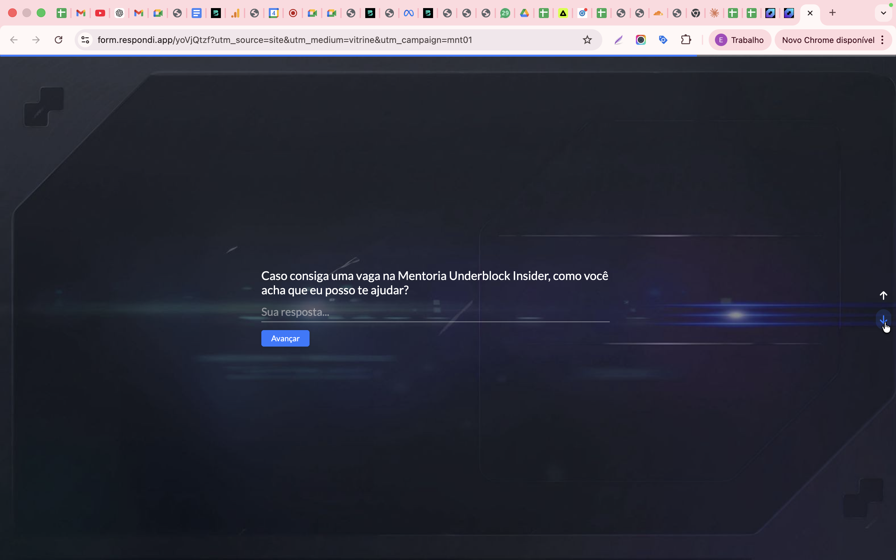

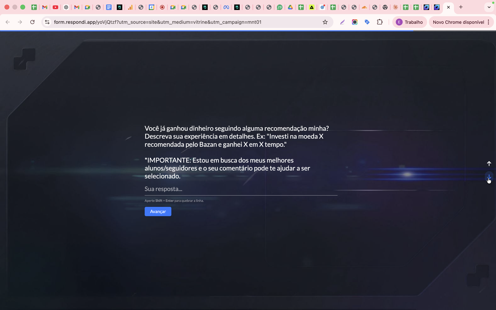

---

### Pergunta 15 — Ancoragem de preço

- **Tipo:** Múltipla escolha
- **Pergunta:** "Quanto você acha que valeria um contato direto comigo e com meu time para analisar sua carteira e trazer orientações personalizadas para este bull market?"
- **Opções:**
  - A) R$ 30.000
  - B) R$ 40.000
  - C) R$ 50.000
  - D) Mais de R$ 50.000

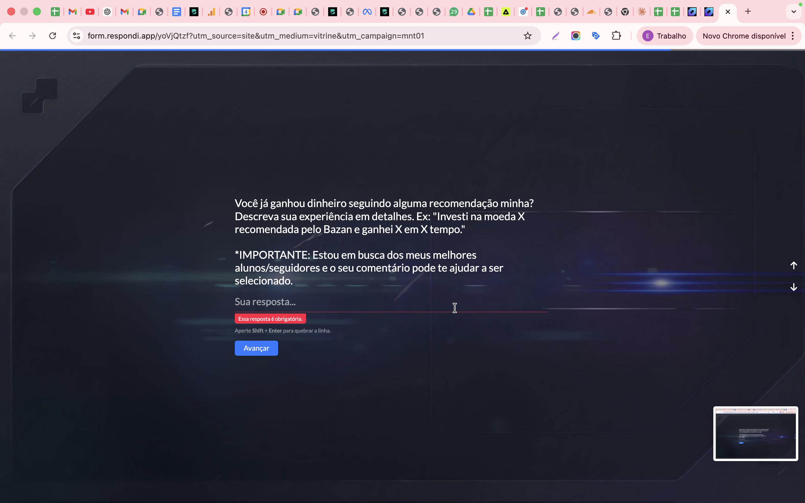

> **Técnica:** Os valores apresentados (R$30k-50k+) são MAIORES que o preço real do produto (R$26.990). O prospect ancora mentalmente em valores altos antes de ver o preço na próxima tela.

---

### Pergunta 16 — Capacidade financeira + preço real

- **Tipo:** Sim/Não
- **Pergunta:** "Cada vaga na Mentoria vai custar R$ 26.990 ou 12x de R$2.631,53 neste momento, e nesta nova turma eu só consigo atender 50 insiders. Caso seja selecionado para uma das vagas, você tem disponibilidade para investir este valor? (Obs: para quem já é membro ativo do Underclub, oferecemos um desconto de R$ 2.200 no valor total.)"
- **Opções:** A) Sim, B) Não
- **Botão:** "Enviar respostas" (botão final, diferente dos anteriores)

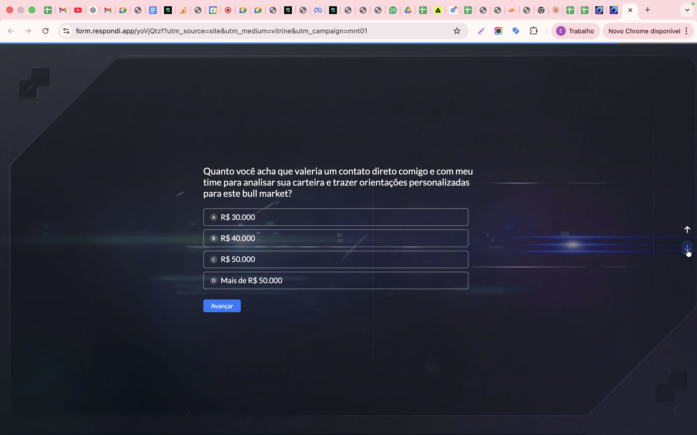

> **Técnica:** Depois de ancorar em R$30-50k, o preço real de R$26.990 parece barato. O desconto para membros Underclub incentiva cross-sell.

---

### Tela final — Thank You Page

- **URL:** `lp2.underblock.com.br/mnt01/typ-y.html` (domínio próprio, não o padrão do Respondi)
- **Título:** "Sua aplicação foi submetida com sucesso!"
- **Texto:**
  - "Nossa equipe vai avaliar sua aplicação e caso você seja selecionado, vamos entrar em contato com você para realizar uma entrevista e avaliar se você está apto para fazer parte da mentoria."
  - "Atenção: caso receba um contato da minha equipe, tente responder o mais breve possível."
  - "Por se tratar de um produto premium onde cada mentorado necessita de uma atenção especial, é humanamente impossível atender muita gente. Por isso eu abri poucas vagas e por isso estamos selecionando cada um dos mentorados."
  - "As vagas serão preenchidas por ordem de chegada."
  - "Boa sorte!"
- **Rodapé:** Logo Mentoria Insider + ícones Instagram e YouTube

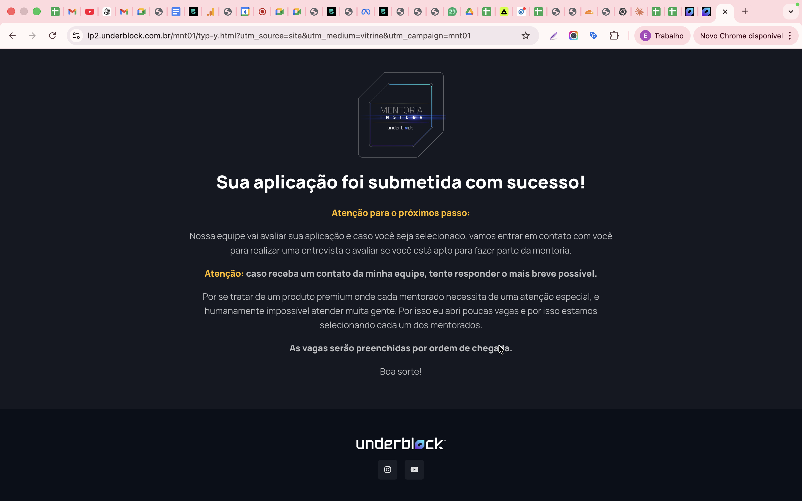

---

## 3. Técnicas de venda identificadas no form

### 3.1 Ancoragem de preço
A pergunta 15 apresenta valores de R$30k a R$50k+ ANTES de revelar o preço real (R$26.990) na pergunta 16. O prospect já "ancorou" mentalmente em valores maiores. Quando vê R$27k, parece barato.

### 3.2 Escassez
"50 insiders" aparece na intro e na pergunta final. "Vagas preenchidas por ordem de chegada" na thank you page.

### 3.3 Exclusividade via seleção
O formulário é de APLICAÇÃO, não de compra. "Caso seja selecionado" inverte a dinâmica: o prospect precisa provar que merece, em vez de o vendedor convencer.

### 3.4 Prova social forçada
A pergunta 14 obriga o candidato a relembrar uma experiência positiva com o Bazan. Ativa memória emocional, reforça autoridade, e os depoimentos podem ser reaproveitados como copy.

### 3.5 Commitment escalation (sunk cost)
18 perguntas = 5-10 minutos de investimento. O formato 1 pergunta por tela disfarça o tamanho. Quem chega na pergunta 16 dificilmente desiste.

### 3.6 Qualificação financeira progressiva
A sequência renda > patrimônio total > patrimônio cripto > disposição a pagar > preço real é gradual. Cada etapa prepara pra próxima.

### 3.7 Cross-sell com desconto
Membros do Underclub (produto mais barato) ganham R$2.200 de desconto. Recompensa fidelidade e incentiva quem está na escada de produtos.

### 3.8 Inteligência competitiva
A pergunta 12 coleta qual casa de análise o prospect já assina. Dado valioso para posicionamento e copy de ads.

### 3.9 Urgência pós-submissão
"Tente responder o mais breve possível" na thank you page cria urgência para a próxima etapa (entrevista).

### 3.10 UX typeform
1 pergunta por tela reduz carga cognitiva. O prospect nunca vê que são 18 perguntas. Completion rate costuma ser 20-40% maior que forms tradicionais.

---

## 4. Form atual da Boost (LP Análise)

**URL:** analise.boostresearch.com.br
**Campos atuais (5):**

| Campo | Tipo | RD Station |
|-------|------|-----------|
| Nome | Texto | `name` |
| E-mail | E-mail | `email` |
| WhatsApp | Telefone | `mobile_phone` |
| Instagram | Texto (opcional) | `cf_instagram` |
| Investe em cripto? | Toggle sim/não | `cf_voce_ja_possui_investimentos_em_bitcoin_cripto` |
| (condicional) Patrimônio cripto | Faixas | `cf_que_otimo_agora_preciso_entender_qual_seu_patrimonio_ho` |
| Investe tradicional? | Toggle sim/não | `cf_voce_ja_investe_no_mercado_tradicional_tesouro_cdi_a` |
| (condicional) Patrimônio tradicional | Faixas | `cf_qual_seu_patrimonio_investido_no_mercado_tradicional` |

**Completion rate estimada:** Alta (poucos campos, form inline na LP)
**Modelo:** Captura rápida > qualificação na reunião

---

## 5. Proposta de teste A/B

### Hipótese

Adicionar 2-3 perguntas estratégicas ao form da Boost pode melhorar a qualificação dos leads SEM destruir a taxa de conversão, desde que:
- O form continue curto (max. 8 campos visíveis)
- As perguntas novas gerem dados acionáveis
- O formato visual não mude (inline, não typeform)

### Variantes do teste

#### Variante A (Controle) -- Form atual
5 campos. Sem alteração. Baseline.

#### Variante B -- Form + 3 perguntas estratégicas
Adicionar APOS os campos atuais:

| Nova pergunta | Tipo | Valor pro negócio |
|---------------|------|-------------------|
| "Há quanto tempo você acompanha o André Franco?" | Select: <1 ano / 1-3 anos / >3 anos | Mede temperatura do lead (frio/morno/quente) |
| "Você assina ou já assinou alguma casa de análise de cripto?" | Texto livre | Inteligência competitiva |
| "Qual sua maior dificuldade com cripto hoje?" | Select: Não sei quando vender / Sem tempo / Medo de perder / Muita informação / Outro | Segmenta por dor -- permite follow-up personalizado |

#### Variante C -- Form estendido com ancoragem leve
Tudo da Variante B + 1 pergunta extra:

| Nova pergunta | Tipo | Valor pro negócio |
|---------------|------|-------------------|
| "O que você espera da análise gratuita?" | Texto livre | Expectativa real = munição pro closer na reunião |

### Métricas do teste

| Métrica | Como medir | Meta |
|---------|-----------|------|
| Taxa de conversão do form | Leads / visitantes únicos (GA4) | Variante B deve ficar dentro de -15% do controle |
| CPL Meta Ads | Custo por lead no Gerenciador | Aceitável até +20% se qualidade subir |
| Taxa de qualificação | Leads >=R$50k / total leads (RD Segmentação) | Variante B deve ser >= Variante A |
| Taxa reunião marcada | Reuniões / leads (CRM RD) | Principal métrica. Se subir, teste venceu |
| CPR (custo por reunião) | Spend / reuniões | Métrica final de decisão |

### Setup do teste

- **Tráfego:** Dividir 50/50 no Meta Ads (2 conjuntos idênticos, cada um apontando pra uma LP)
- **Duração:** 14 dias mínimo (pelo ciclo de venda longo)
- **Volume mínimo:** 100 leads por variante para significância estatística
- **Budget estimado:** R$600/dia x 14 dias = R$8.400

---

## 6. O que pode acontecer com mais perguntas no form

### Cenário positivo (o que a gente QUER que aconteça)

**Leads mais qualificados**
Cada pergunta extra funciona como um micro-filtro. Quem não é sério desiste no meio. Quem completa demonstrou interesse real. O time comercial gasta menos tempo com leads frios.

**Dados para personalizar a reunião**
Se o closer sabe que o lead "não sabe quando vender" e "acompanha o André há 3 anos", a reunião começa num nível diferente. Menos tempo educando, mais tempo fechando.

**Segmentação para remarketing**
Saber a dor principal permite criar audiências customizadas. Quem respondeu "medo de perder" recebe ads diferentes de quem respondeu "sem tempo".

**Inteligência competitiva grátis**
Saber quais casas de análise o ICP já usa/usou informa posicionamento, copy e objeções mais comuns.

### Cenário negativo (os RISCOS reais)

**Queda na taxa de conversão (-15% a -40%)**
Cada campo extra no form reduz a conversão. Dados de benchmark:
- 3 campos: ~25% de conversion rate
- 5 campos: ~20%
- 7 campos: ~15%
- 10+ campos: ~10%

O form atual com 5 campos já está num ponto bom. Ir pra 8 pode custar 15-25% dos leads. Isso é aceitável SE os leads restantes forem melhores.

**CPL sobe proporcionalmente**
Se a conversão cai 20%, o CPL sobe 25% (mesma matemática). Se hoje o CPL é R$200, pode ir pra R$250. O budget precisa absorver isso.

**Atrito no mobile**
70%+ do tráfego Meta vem de mobile. Forms longos em tela pequena são dolorosos. O Underblock resolve isso com typeform (1 pergunta por tela). Se a Boost mantiver o form inline (tudo na mesma página), 8 campos podem parecer muito num celular.

**Perda de leads impulsivos**
Existe um perfil de lead que converte no impulso: viu o ad, clicou, preencheu rápido, agendou. Esse lead funciona bem na reunião. Com mais perguntas, ele desiste no meio e vai embora. Não volta.

**Abandono no meio do form (leads incompletos)**
Com 5 campos, ou o cara preenche tudo ou não preenche nada. Com 8 campos, pode preencher 5 e largar. Esse lead incompleto não entra no RD, não recebe follow-up, e o dinheiro do clique foi jogado fora.

**Fadiga de form em remarketing**
O público quente (retargeting) já viu a LP antes. Se na segunda visita o form parece maior, a rejeição pode aumentar. O remarketing costuma ter conversion rate alto justamente porque é rápido.

### Cenário mais provável

A Variante B (3 perguntas extras) provavelmente vai gerar:
- **-15% a -20% de leads totais** (menos volume)
- **+10% a +25% na taxa de qualificação** (melhor qualidade)
- **CPL sobe ~20%**, mas CPR (custo por reunião) pode cair se a taxa de agendamento subir
- **Net effect:** levemente positivo se o closer aproveitar os dados na reunião

---

## 7. Recomendação

### Fazer agora (sem teste A/B necessário)

1. **Adicionar "qual casa de análise assina" como campo opcional** -- Dado competitivo valioso. Campo opcional não reduz conversão de forma significativa.
2. **Melhorar a thank you page** -- Hoje é padrão RD. Trocar por página personalizada com próximos passos claros, foto do André, e reforço de autoridade (como a Underblock faz).

### Fazer com teste A/B

3. **Variante B (3 perguntas)** -- Rodar por 14 dias com split 50/50. Se CPR melhorar ou ficar neutro, adotar. Se piorar mais de 15%, reverter.

### Não fazer

4. **NÃO copiar o modelo de 18 perguntas** -- Só funciona com audiência quente que já acompanha o mentor. O tráfego frio da Boost não aguenta.
5. **NÃO revelar preço no form** -- O modelo "gratuito > reunião > proposta" da Boost funciona melhor para aquisição de leads.
6. **NÃO trocar o form inline por typeform** -- O form inline na LP é mais rápido e integra direto com RD. Typeform adiciona redirect, perde UTMs, complica tracking.

---

## 8. Comparativo visual lado a lado

| Aspecto | Underblock Insider | Boost — Crypto Intelligence PRO (atual) | Boost (proposta B) |
|---------|-------------------|----------------------|---------------------------|
| Produto | Mentoria Underblock Insider | Crypto Intelligence PRO | Crypto Intelligence PRO |
| Preço | R$26.990/ano (explícito no form) | ~R$20k/ano (revelado na reunião) | ~R$20k/ano (revelado na reunião) |
| Perguntas | 18 | 5 (+condicionais) | 8 (+condicionais) |
| Formato | Typeform (1 por tela) | Inline na LP | Inline na LP |
| Tempo médio | 5-10 min | ~1 min | ~2 min |
| Dado competitivo | Sim (pergunta 12) | Não | Sim |
| Segmentação por dor | Não direto | Não | Sim |
| Ancoragem preço | Sim (R$30-50k) | Não | Não (fica pra reunião) |
| Thank you page | Custom no domínio | Padrão RD | Custom (a fazer) |
| Plataforma | Respondi.app | API RD Station | API RD Station |
| CPL estimado | Alto (form longo + produto caro) | ~R$200 | ~R$240-250 |

---

*Documento gerado em 04/mai/2026. Screenshots em `prints-underblock/`.*
